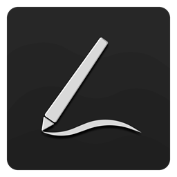

<style>
  .ntd-hero { text-align: center; }
  .ntd-subtitle { max-width: 760px; margin: 0 auto; }
  .ntd-grid { width: 100%; }
</style>

<div class="ntd-hero" align="center">
  
  <h1>NextTabletDriver</h1>
  <p class="ntd-subtitle">
    A modern, low-latency tablet driver for osu!, digital art, and everyday pen input.
    Built in Rust with a native egui interface, cross-platform device support, and precise mapping controls.
  </p>
  <p>
    <a href="https://github.com/Next-Tablet-Driver/NextTabletDriver/releases">
      
    </a>
    
    
    
  </p>
</div>

## Overview

NextTabletDriver gives players and artists a focused tablet driver with fast input handling, flexible active area mapping, and a clean desktop UI. It is designed to replace vendor-specific drivers when you need consistent behavior across devices and operating systems.

<table class="ntd-grid">
  <tr>
    <td><strong>Low latency</strong></td>
    <td>Optimized polling, high-priority input threads, and a compact Rust pipeline.</td>
  </tr>
  <tr>
    <td><strong>Precise mapping</strong></td>
    <td>Active area, target display area, rotation, aspect ratio locking, and display edge snapping.</td>
  </tr>
  <tr>
    <td><strong>Cross-platform</strong></td>
    <td>Windows support through native input APIs and Linux support through <code>uinput</code>.</td>
  </tr>
  <tr>
    <td><strong>Custom UI themes</strong></td>
    <td>JSON themes with colors, spacing, semantic colors, and osu! playfield opacity controls.</td>
  </tr>
  <tr>
    <td><strong>Telemetry and filters</strong></td>
    <td>Built-in console, performance panels, Devocub Antichatter, and HandSpeed WebSocket output.</td>
  </tr>
</table>

## Supported Hardware

The driver ships with community-maintained JSON configurations for many tablet families:

- Wacom, including Intuos, Bamboo, Cintiq, and One devices
- Huion and Kamvas devices
- XP-Pen and UGEE devices
- Gaomon, VEIKK, Artisul, Parblo, XenceLabs, UC-Logic, and more

Tablet definitions live in the [`tablets`](tablets) directory. New devices can be added by contributing a configuration JSON and, when needed, a parser implementation.

## Installation

### Windows

1. Download the latest Windows release from the [releases page](https://github.com/Next-Tablet-Driver/NextTabletDriver/releases).
2. Run the installer or extract the portable build.
3. Launch `next_tablet_driver.exe`.

### Arch Linux and AUR

An AUR package recipe is provided as `nexttabletdriver-git`.

```bash
git clone https://aur.archlinux.org/nexttabletdriver-git.git
cd nexttabletdriver-git
makepkg -si
```

The package installs the binary, desktop entry, icon, license, and udev rules.

### Generic Linux

NextTabletDriver requires access to HID tablet devices and `/dev/uinput`.

```bash
sudo cp scripts/99-nexttabletdriver.rules /etc/udev/rules.d/
sudo udevadm control --reload-rules
sudo udevadm trigger
sudo usermod -aG input "$USER"
```

Log out and back in after adding your user to the `input` group.

More details are available in [`scripts/README-linux.md`](scripts/README-linux.md).

## Build From Source

### Requirements

- Rust 1.95 or newer
- `pkgconf`
- `hidapi`
- Linux only: `gtk3`, `libxkbcommon`, `libglvnd`, `wayland`, and `uinput` support

### Build

```bash
cargo build --release --locked
```

The release binary is created at:

```text
target/release/next_tablet_driver
```

On Linux cross-compilation targets, the binary may be under a target-specific directory such as:

```text
target/x86_64-unknown-linux-gnu/release/next_tablet_driver
```

## Project Layout

```text
src/
  app/        Application lifecycle, layout, services, update flow
  core/       Configuration models, math, geometry, transforms
  drivers/    Tablet detection, parsers, and device configuration loading
  engine/     Input polling, projection pipeline, OS injection
  filters/    Optional processing filters and statistics output
  settings/   Profile and theme persistence
  ui/         egui panels, widgets, and theme helpers
tablets/      Device JSON definitions
scripts/      Linux udev helpers and packaging utilities
resources/    Icons and bundled fonts
```

## Configuration and Themes

Settings are stored as JSON profiles. The UI supports importing and exporting profiles from the File menu.

Custom themes are documented in [`docs/THEMES.md`](docs/THEMES.md). Themes can control the main palette, widget styling, spacing, semantic colors, and the opacity of the osu! playfield overlay.

## Developer Notes

Generate local Rust documentation with:

```bash
cargo doc --no-deps --open
```

Run the main validation pass with:

```bash
cargo test
```

For packaging changes on Arch Linux, validate with:

```bash
makepkg --printsrcinfo
makepkg -si
```

## Contributing

Contributions are welcome. Good first contributions include tablet configuration updates, parser fixes, Linux packaging improvements, theme examples, and UI polish.

When adding hardware support, include the device VID/PID, physical dimensions, report parser name, and any initialization reports required by the tablet.

## License

NextTabletDriver is distributed under the MIT License. See [`LICENSE`](LICENSE) for details.
