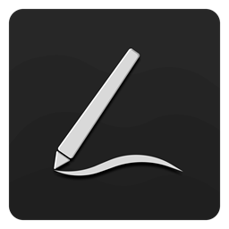

<div class="ntd-hero" align="center">
  
  <h1>NextTabletDriver</h1>
  <p class="ntd-subtitle">
    A modern, low-latency tablet driver for osu!, digital art, and everyday pen input.
    Built in Rust with a Tauri + Svelte interface, cross-platform device support, and precise mapping controls.
  </p>
  <p>
    <a href="https://github.com/Next-Tablet-Driver/NextTabletDriver/releases">
      
    </a>
    <a href="https://github.com/Next-Tablet-Driver/NextTabletDriver/actions/workflows/rust-quality-check.yml">
      
    </a>
    
    
    
  </p>
</div>

> **Attribution notice:** The tablet configuration files under [`tablets/OpenTabletDriver`](tablets/OpenTabletDriver) are a git submodule pinned to the [OpenTabletDriver](https://github.com/OpenTabletDriver/OpenTabletDriver) project, licensed under the **GNU Lesser General Public License v3.0 (LGPLv3)**. This submodule keeps OpenTabletDriver's LGPLv3-licensed content separate from NextTabletDriver's own MIT license, it is not copied into the MIT-licensed source tree. See the [License](#license) section for details.

## What is NextTabletDriver?

If you play osu! with a tablet, or draw digitally, your tablet's driver is the piece of software that turns pen movement into cursor movement on screen. NextTabletDriver is a free, open-source driver built to be fast, precise, and easy to set up, so you're not stuck with a manufacturer's driver that's slow, bloated, or missing the controls you actually need.

It works with tablets from many different brands, so you don't need to keep multiple drivers installed if you own devices from more than one manufacturer.

**Why people use it:**

- **Feels instant.** The driver is built in Rust for very low input lag, so your pen movement shows up on screen with minimal delay, important for fast-paced gameplay.
- **Precise area mapping.** Choose exactly which part of your tablet maps to which part of your screen, rotate it, lock its aspect ratio, or snap it to a screen edge, all from a simple visual editor.
- **Works on Windows and Linux.** One driver, consistent behavior, no matter your OS.
- **Looks the way you want.** Customize the app's colors and layout with themes, and optionally show a guide for where the osu! playfield sits within your active area, right in the tablet preview.
- **Shows you what's happening.** Built-in panels let you watch live pen data, smoothing filters, and input latency, handy when you're fine-tuning your setup or troubleshooting a tablet.

## Supported Tablets

NextTabletDriver supports tablets from many manufacturers, including:

- **Wacom** (Intuos, Bamboo, Cintiq, and more)
- **Huion** (including Kamvas)
- **XP-Pen** and **UGEE**
- **Gaomon, VEIKK, Artisul, Parblo, XenceLabs, UC-Logic**, and more

Don't see your tablet listed, or having trouble with detection? Device support is community-maintained and grows over time, see [Contributing](#contributing) below for how to help add a device.

## Installation

### Windows

1. Download the latest Windows release from the [releases page](https://github.com/Next-Tablet-Driver/NextTabletDriver/releases).
2. Run `NextTabletDriver_<version>_x64-setup.exe` (or `_arm64-setup.exe` on ARM devices). It also replaces an older Inno Setup install automatically.
3. Launch NextTabletDriver and plug in your tablet.

### Arch Linux and AUR

An AUR package recipe is provided as `nexttabletdriver-git`.

```bash
git clone https://aur.archlinux.org/nexttabletdriver-git.git
cd nexttabletdriver-git
makepkg -si
```

The package installs the binary, desktop entry, icon, license, and udev rules.

### Generic Linux

The [releases page](https://github.com/Next-Tablet-Driver/NextTabletDriver/releases) provides a `.deb` (Debian/Ubuntu, installs the udev rules for you) and an `.AppImage` for x86_64 and ARM64.

NextTabletDriver requires access to HID tablet devices and `/dev/uinput`. With the AppImage, install the udev rules yourself:

```bash
sudo cp scripts/99-nexttabletdriver.rules /etc/udev/rules.d/
sudo udevadm control --reload-rules
sudo udevadm trigger
```

This grants access to the current desktop user instantly, no group membership or
logout required. If you run the driver from a headless/non-logind session, add
your user to the `input` group instead and log out and back in:
`sudo usermod -aG input "$USER"`.

More details are available in [`scripts/README-linux.md`](scripts/README-linux.md).

## Settings, Profiles and Themes

Your settings are saved as profiles, so you can switch between setups (e.g. one for osu!, one for drawing) from the File menu, which also lets you import and export profiles to share or back them up.

Want to change how the app looks? Pick a built-in theme in **Settings > Themes**.

## Contributing

NextTabletDriver is open source and welcomes contributions, good first contributions include adding a new tablet, fixing a parser bug, Linux packaging improvements, theme examples, and UI polish. Building from source, the codebase layout, and the coding standards we follow are documented in [`CONTRIBUTING.md`](.github/CONTRIBUTING.md).

When adding support for a new tablet, please include its device VID/PID, physical dimensions, and any other details the driver needs to recognize it correctly.

## License

NextTabletDriver is distributed under the MIT License. See [`LICENSE`](LICENSE) for details.

### Third-Party Licenses

The tablet configuration files under [`tablets/OpenTabletDriver`](tablets/OpenTabletDriver) are a git submodule pinned to [OpenTabletDriver](https://github.com/OpenTabletDriver/OpenTabletDriver), which is licensed under the **GNU Lesser General Public License v3.0 (LGPLv3)**. This submodule is a separate, distinct component under the terms of the LGPLv3 and is not relicensed under NextTabletDriver's MIT license. The full text of the LGPLv3 can be found at [gnu.org/licenses/lgpl-3.0](https://www.gnu.org/licenses/lgpl-3.0.html).

Copyright © OpenTabletDriver contributors.
